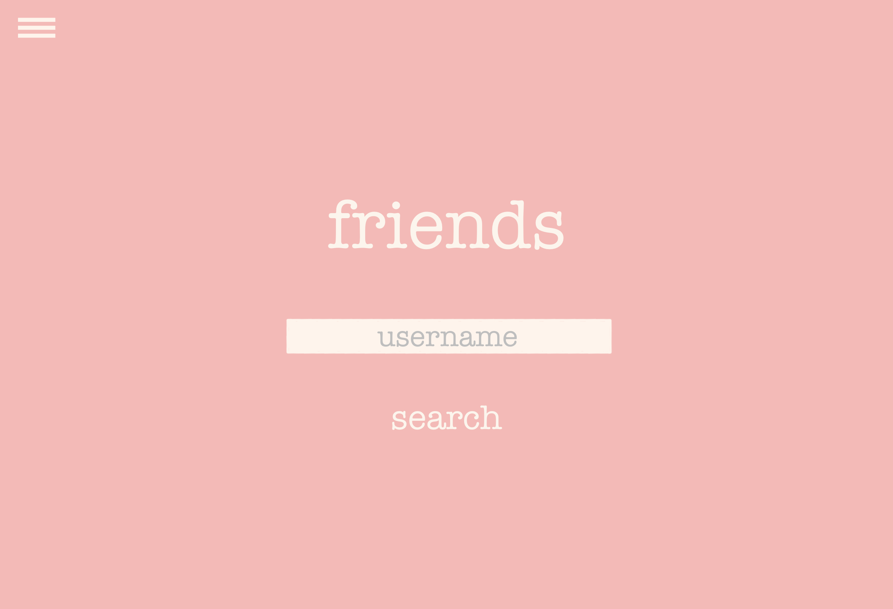

# Project Proposal

## vanity.

### Project Summary

Vanity is a social media service for people to connect over shared interests in makeup and skincare and discover new products. We primarily target users of beauty products and provide two main features - 

1. A product reviews feature that enables users to look up specific products and read or write reviews by customers who previously purchased the product

2. A social media service that enables users to connect with friends and view each other’s “makeup bags” — in effect to see which specific products their friends purchased.

Currently, there exists no form of online app (besides general purpose apps like Instagram) for the makeup and skincare community to connect. Our web application aims to address this need.   

### Description

This application will be a “makeup bag” in digital form. Users will be able to add products to their personal makeup bag as they purchase products in real life, and they will be able to view their friends' makeup bags to see their favorite products and get recommendations for themselves when they are in the market. In real life, many friends regularly share product recommendations. This is a form of bonding that the makeup and skincare community thrives on. With a minimal, attractive user interface, this app will build the bonds of many makeup and skincare users. By maintaining one's own bag, a user will visually be able to see every product they own. When viewing friends bags, users can explore what is making their friends' skin and makeup so beautiful!

Makeup and skincare users are always in the market for more products, so we will also have a search bar to explore new products and see their reviews. Because of the sheer quantity of brands and products, hearing from actual people is vital. Allowing a user to click on their friend's favorite makeup product and simultaneously view reviews, the user will be more confident about their decision if they want to purchase it, too. This will also increase the reach of brands, because they will have one more platform where users can find them.

As a whole, this application is a digital embodiment of the inclusive, lavish, and friendly beauty community.

### Creative Component

Our creative component will be a personalized recommendation system. We will design an algorithm that uses the current products in a user’s makeup bag to determine which new products the user is likely to be interested in. We will also incorporate this into the product search feature, where a user might search for a general tag (e.g. “moisturizer”) and the algorithm will order its best recommendations for that specific tag at the top of the page.

### Usefulness

Our web application is useful for people who wear makeup and who would like to share their favorite products with their friends in a streamlined and social media-like way. At the same time, they are able to search for a friend by username to learn more about their friends’ favorite products, which they can then try for themselves. 

Furthermore, every product on the app will have reviews that have been compiled from online resources. From our personal experiences, it can sometimes be frustrating checking several different websites (amazon, reddit, etc.) just to see a variety of reviews for a product, when deciding whether to purchase it. To our knowledge, there is also no web or mobile app that lets you compile a “makeup bag” of your current products to share with friends. In our app, we are creating this new functionality while also aggregating many reviews in one place for easy access by users.

### Realness

We will be using two main data sources: A beauty (skincare, makeup, etc.) product database and a data set containing reviews for these products:

1. **Sephora Products**  _This is a Kaggle dataset that offers information about over 8000 skincare and beauty products that are sold at Sephora. This dataset includes product names, pricing, brands, rating, love_count, and more._

2. **Cosmetics and Beauty Products Reviews - Top Brands** _This is a Kaggle dataset that easily integrates with the Sephora Products dataset due to the ProductId key linking the reviews to the appropriate products. This dataset contains reviews and customer ratings for the beauty products in the Sephora products dataset. Along with the review text itself, each row contains the product id, author id, rating, whether they recommend the product, the level of helpfulness of the review, and more._

When a user views a specific product (whether they searched for it or found it through a friend’s makeup bag), the corresponding reviews will be presented to the user, giving the user information to help them decide if they would like to add that product to their own makeup bag.

### Functionality

The core features of our app work enable users to, in **CRUD** terms:

**READ**
```
View (GET) their “makeup bag”
```

```
Search (GET) for their friends’ “makeup bags” to discover what products their friends are using
```

```
View reviews for a product (GET)
```


**CREATE, UPDATE, DELETE**
```
Add/Remove new products to/from their own makeup bag (POST/PUT)
```

**CREATE**

```
Write reviews for a product (POST)
```

**MVP (Minimum Viable Product)** — Viewing your bag, adding items to your bag, viewing friends’ bags, and seeing product reviews


# A low-fidelity UI mockup

## 1 - Welcome page


**Buttons**

```log in``` _leads to screen 2._

```sign up``` _leads to screen 3._


## 2 - Login page


**Text inputs:**

``` username ```

``` password  ```

**Buttons**

``` submit ```

## 3 - Sign up page


**Text inputs:**

``` username ```

``` password ```

``` password confirmation ```

**Buttons:**

``` submit ``` _leads to screen 4_

## 4 - Bag page


_Displays contents of any makeup bag (user’s or friends’)_

**Buttons:**

```+``` _leads to screen 7_

Hamburger menu _leads to screen 5_

## 5 - Hamburger menu


**Buttons:**

```my bag``` _leads to screen 4_

```friends``` _leads to screen 6_

```product reviews``` _leads to screen 7_

## 6 - Friends search page



**Text inputs:**

```username``` _(friend’s username)_

**Buttons:**

```search``` _leads to screen 4_

Hamburger menu _leads to screen 5_


## 7 - Products search page


**Text inputs:**

```Product name```

**Buttons:**

```search``` _leads to screen 8_

Hamburger menu _leads to screen 5_


## 8 - Product reviews page


**Scrollable elements:**

Reviews section

**Buttons:**

Hamburger menu _leads to screen 5_

```add to bag``` _leads to screen 4_


### Project Work Distribution:

The **backend** of our project will be led by Julie and Nitya. In our web application, the backend tasks will be building the Flask API and managing the host infrastructure. Nitya will lead the creation of the endpoints in the API, which will require collaboration with the frontend team to understand what endpoints are necessary for the functions of the app. For example, when displaying the products in the user’s bag, there will need to be an endpoint that grabs the list of products. Julie will lead the SQL queries. She will write the necessary queries that will navigate the backend seamlessly. Additionally, Nitya will manage the host infrastructure such as the API and Database server. Julie will determine the Database Schemas.

The **frontend** of the project will be led by Oju and Ria. In our web app, the frontend will be written using React and CSS. React will control the navigation and the components of the app. For example, one of the essential React components will include the hamburger menu which will allow the user to navigate between their bag, their friends’ bags, and the products search bar. Ria will write most of the CSS files and determine the visual layout, ensuring that the colors and fonts stay consistent throughout the app. Oju will write the React files to ensure that there is smooth navigation and efficient functions that allow the frontend to connect with the backend.

Although we will divide up tasks as stated above, many of these tasks will require collaboration and collaborative decision-making. Our group will maintain good communication to make sure that all of the elements work together.
